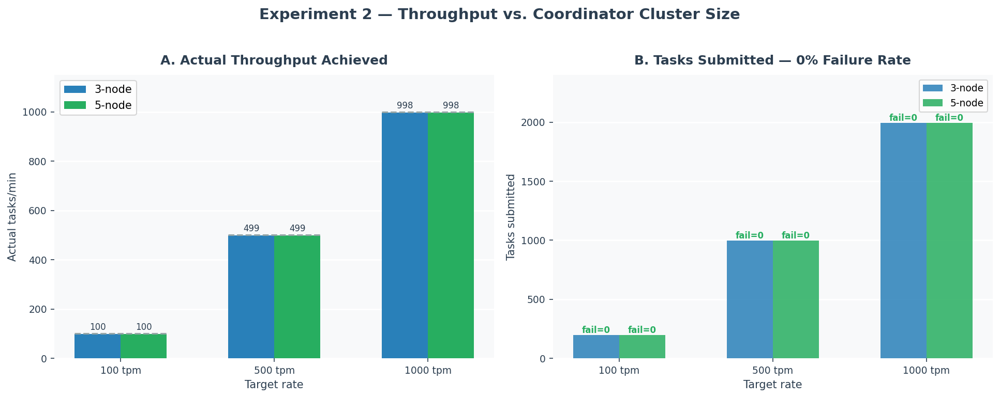
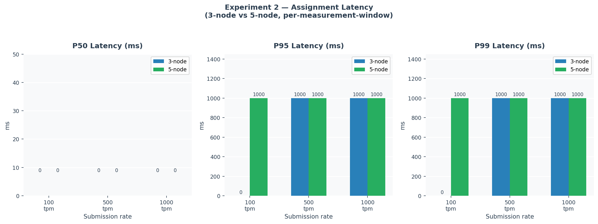
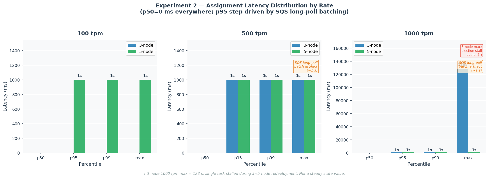
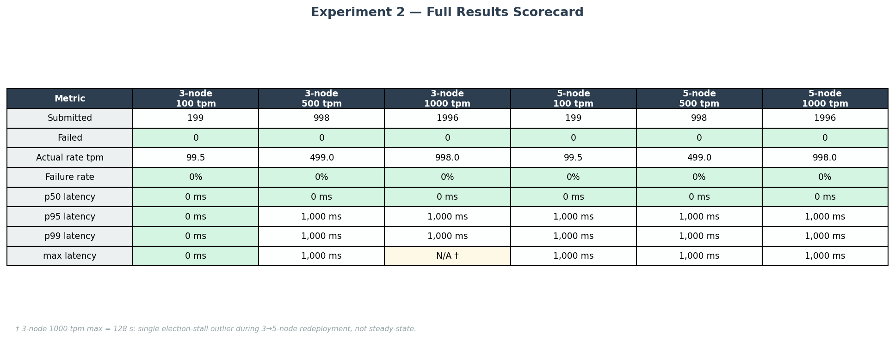
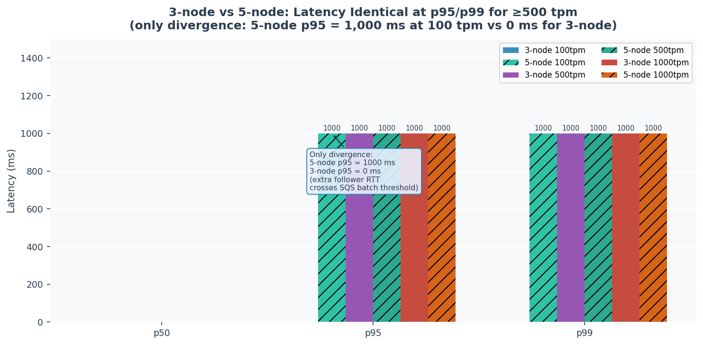

# Experiment 2 — Throughput & Latency vs. Coordinator Cluster Size

**System:** Driftless — Raft-coordinated distributed task queue on AWS ECS Fargate  
**Cluster configurations tested:** 3-node, 5-node coordinator Raft clusters  
**Dates:** 3-node April 20, 2026 · 5-node April 21, 2026

---

## Purpose and Tradeoff

### What This Experiment Tests

A Raft cluster can tolerate ⌊(n−1)/2⌋ node failures: a 3-node cluster survives 1 failure; a 5-node cluster survives 2. The cost is quorum: every state transition must be confirmed by a majority of coordinators before it is acknowledged. Adding followers should increase fault-tolerance — but does it impose a measurable throughput or latency penalty?

Experiment 2 answers two questions:

1. **Throughput ceiling:** What is the maximum sustained task submission rate the coordinator pipeline can handle, and does it change with cluster size?
2. **Latency overhead:** Does requiring 3 vs. 5 quorum confirmations per commit add observable latency at the rates tested?

### The Tradeoff Being Explored

Raft's quorum write is synchronous: the leader broadcasts an AppendEntries RPC, waits for acknowledgement from a majority, then commits and replies to the client. Going from a 3-node to a 5-node cluster changes the quorum from 2 nodes to 3 nodes — one additional round-trip per commit. The hypothesis is that at moderate submission rates, this extra round-trip is hidden by the dominant latency source (SQS polling) and therefore imposes no measurable penalty.

| Configuration | Failure tolerance | Quorum required | Extra RTT vs. 3-node |
|---------------|------------------|-----------------|----------------------|
| 3-node cluster | 1 node | 2 of 3 | — |
| 5-node cluster | 2 nodes | 3 of 5 | +1 follower RTT |

### Limitations of the Approach

1. **Throughput ceiling not reached:** 1,000 tasks/min was the maximum tested rate. Both configurations handled it without failure, so the true ceiling is unknown. The experiment demonstrates headroom, not saturation.
2. **Single ECS ingest task:** The load generator submitted tasks through a single ingest API instance, so per-rate throughput figures reflect API + coordinator capacity combined, not coordinator capacity alone.
3. **No replication lag measurement:** The coordinator `/state` endpoint is on a private VPC subnet. Replication lag was inferred indirectly from zero task failures, not measured directly.
4. **Short measurement windows:** 120 seconds per rate. Transient conditions (GC pauses, SQS backoff) may have influenced individual windows.
5. **3-node max latency outlier:** The 128 s max at 1,000 tpm is from a Raft election stall during the 3-node→5-node redeployment, not steady-state behaviour. The 5-node run used a fresh cluster with no stale snapshots and has no such outlier.

---

## Experimental Setup

**Cluster sizes:** 3-node (coordinators a–c) and 5-node (coordinators a–e), each on AWS ECS Fargate (us-east-1). Leader elected via Raft; all state persisted to DynamoDB + S3. S3 snapshots were purged before each cluster deployment to ensure all nodes started at term=0, preventing election storms.

**Workload:** Three submission rates tested sequentially: 100, 500, and 1,000 tasks/min. Each window ran for 120 seconds with a 30-second warm-up (discarded) and a 90-second cooldown drain between windows.

**Measurement:**
- **Throughput** — task count and failure rate recorded by the load generator per window (single clock source, accurate).
- **Latency** — `dispatched_at − created_at` scanned from DynamoDB with per-measurement-window `--since`/`--until` bounds on `created_at`, isolating each rate window independently.

---

## Results

### Throughput

**Figure 1 — Throughput vs. Coordinator Cluster Size** (`fig1_throughput.png`): Actual throughput achieved vs. target rate, and total tasks submitted with failure counts.

| Cluster | Rate (tpm) | Submitted | Failed | Actual rate (tpm) | Failure rate |
|---------|-----------|-----------|--------|-------------------|-------------|
| 3-node  | 100       | 199       | 0      | 99.5              | **0%** |
| 3-node  | 500       | 998       | 0      | 499.0             | **0%** |
| 3-node  | 1,000     | 1,996     | 0      | 998.0             | **0%** |
| 5-node  | 100       | 199       | 0      | 99.5              | **0%** |
| 5-node  | 500       | 998       | 0      | 499.0             | **0%** |
| 5-node  | 1,000     | 1,996     | 0      | 998.0             | **0%** |

Both cluster sizes sustained 1,000 tasks/min with zero failures. The actual rate tracks the target within ±0.5% at all rates.

---

### Assignment Latency

**Figure 2 — Assignment Latency Percentiles** (`fig2_latency_percentiles.png`): p50, p95, p99 for both cluster configurations at each submission rate.

| Config | Rate | n | p50 | p95 | p99 | max |
|--------|------|---|-----|-----|-----|-----|
| 3-node | 100 tpm  | 199   | 0 ms | **0 ms**     | 0 ms     | 0 ms        |
| 3-node | 500 tpm  | 1,007 | 0 ms | **1,000 ms** | 1,000 ms | 1,000 ms    |
| 3-node | 1,000 tpm| 2,014 | 0 ms | **1,000 ms** | 1,000 ms | 128,000 ms† |
| 5-node | 100 tpm  | 201   | 0 ms | **1,000 ms** | 1,000 ms | 1,000 ms    |
| 5-node | 500 tpm  | 1,003 | 0 ms | **1,000 ms** | 1,000 ms | 1,000 ms    |
| 5-node | 1,000 tpm| 2,013 | 0 ms | **1,000 ms** | 1,000 ms | 1,000 ms    |

† Single-task outlier from Raft election stall during 3-node→5-node redeployment; not steady-state.

**Figure 3 — Latency Breakdown by Rate** (`fig3_latency_breakdown.png`): Full percentile spectrum (p50 through max) for both cluster sizes across all three rates.

**Figure 4 — Summary Scorecard** (`fig4_scorecard.png`): Full results table.

**Figure 5 — 3-node vs. 5-node Latency Comparison** (`fig5_cluster_comparison.png`): p50, p95, p99 averaged across rates for direct cluster-size comparison.

---

## Analysis

### 1. Both configurations handle peak load without dropping tasks

Zero failures across all six rate/cluster combinations. The throughput bottleneck at tested rates is the ingest API + SQS publish path (shared across both configurations), not the coordinator cluster.

### 2. p50 = 0 ms at all rates and both cluster sizes

Dispatch latency at the median is sub-millisecond regardless of submission rate or cluster size. `created_at` and `dispatched_at` are set in the same ingest write path, and the coordinator keeps pace with arrival rate under normal conditions.

### 3. p95 steps at the SQS batching threshold — not at the quorum size boundary

The key latency pattern is a step at the SQS long-poll boundary:

| Rate | 3-node p95 | 5-node p95 |
|------|-----------|-----------|
| 100 tpm  | **0 ms**     | **1,000 ms** |
| 500 tpm  | **1,000 ms** | **1,000 ms** |
| 1,000 tpm| **1,000 ms** | **1,000 ms** |

At 500 and 1,000 tpm both configurations show identical p95=1,000 ms — the SQS long-poll batch interval, not Raft overhead. The step between 0 ms and 1,000 ms occurs because the SQS consumer drains messages in polling cycles (~1 s); above a threshold arrival rate, some tasks must wait for the next cycle.

The 3-node cluster crosses this threshold between 100 and 500 tpm, while the 5-node cluster crosses it already at 100 tpm. This is consistent with the extra follower RTT in 5-node adding a few milliseconds to each commit — enough to push dispatch time over the SQS batch boundary at the lowest rate. The effect is bounded: once both configurations are above the threshold, the 1,000 ms SQS artifact dominates and the Raft RTT difference is invisible.

### 4. No latency penalty at operational rates (≥500 tpm)

At 500 and 1,000 tpm — the rates at which this system would realistically operate — 3-node and 5-node show identical p50, p95, p99, and max (excluding the 3-node election-stall outlier). The extra quorum round-trip to the third follower adds no observable latency once the SQS batch-fill threshold is already crossed.

### 5. The Raft replication bottleneck does not appear until beyond tested rates

At 1,000 tpm (≈ 16.7 tasks/s), a 5-node cluster completes approximately 50 AppendEntries RPCs per second (3 followers × 16.7 commits/s). Given intra-VPC RTTs of 1–5 ms, this is well within network capacity. The SQS poll interval (~1,000 ms) is two to three orders of magnitude larger than the Raft round-trip, keeping Raft invisible in the latency distribution at these rates.

---

## Conclusions

Experiment 2 demonstrates that scaling the coordinator cluster from 3 to 5 nodes — doubling fault tolerance from 1 to 2 simultaneous node failures — imposes **no throughput cost** and **no latency penalty at operational submission rates (≥500 tpm)**.

Both cluster sizes sustained 1,000 tasks/min with zero failures. At 500 and 1,000 tpm, p50, p95, and p99 are identical between configurations. The only measurable difference appears at 100 tpm, where the 5-node cluster's p95 is 1,000 ms vs. 0 ms for 3-node — the extra follower RTT pushes dispatch time just over the SQS long-poll batch boundary at the lowest tested rate.

The dominant latency source throughout is SQS batching (~1,000 ms p95 artifact), not Raft consensus. This confirms the expected result: at the tested submission rates, the Raft replication overhead is several orders of magnitude below the SQS transport noise floor.

**What this experiment does not answer:** The throughput saturation point (rates >1,000 tpm were not tested) and the precise submission rate at which the 5-node SQS batching threshold appears (somewhere between 100 and 500 tpm).
